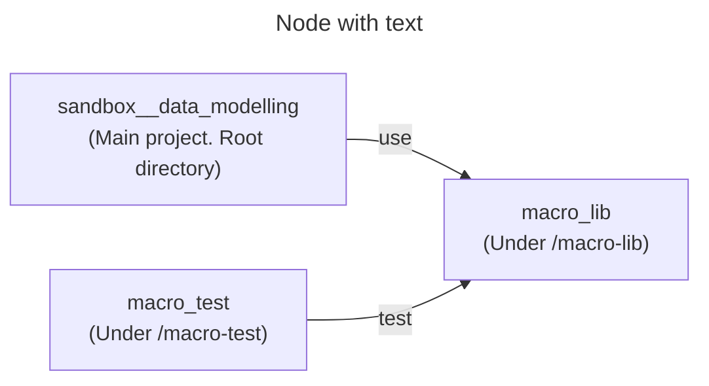

# Sandbox: Data modelling

## Prerequisites

* [mise](https://mise.jdx.dev/)

## Project structure



## Setup

```sh
mise install
uv sync

# Install macro-lib as a package to the main project and the test project.
dbt deps
dbt deps --project-dir macro-test
```

## Usage

```sh
dbt build
```

## Test macros

```sh
dbt test --project-dir macro-test
```

## Scenarios

Subprojects (we call them scenarios) have their directories prefixed with `sce_N__` (abbreviation for "scenario N").

For more details, refer to each scenario's [docs](/docs).
