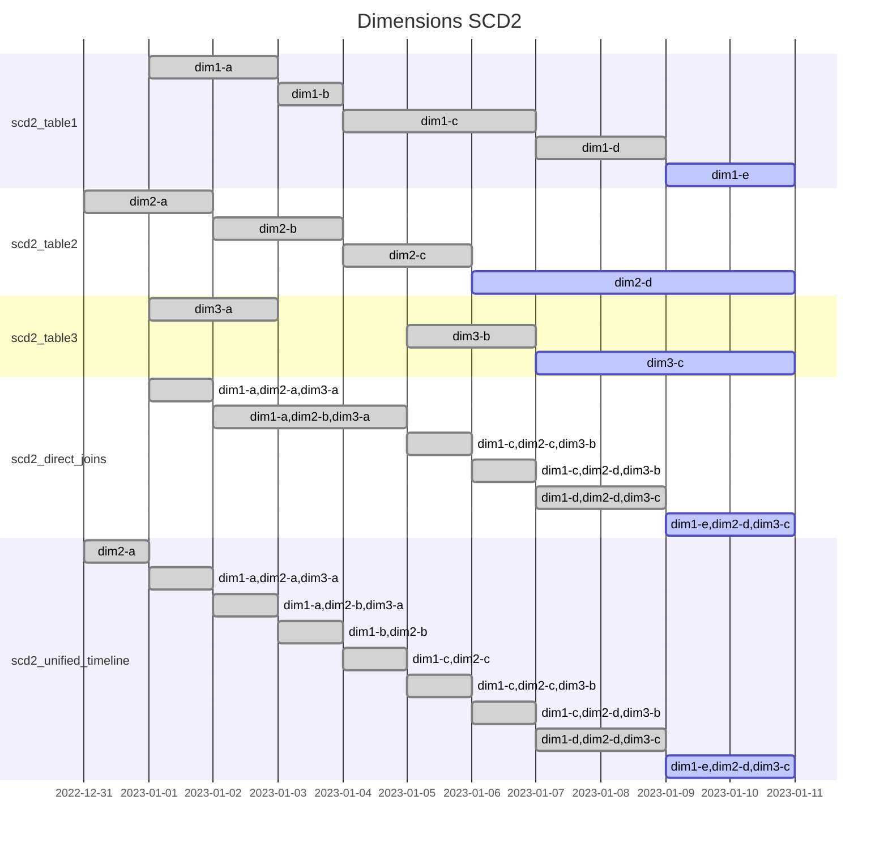

# SCD2 joins

https://infinitelambda.com/multitable-scd2-joins/

## Setup

```sh
dbt build
```



## Generating mermaid Gantt chart sections

```sql
select
    concat_ws(',', dim1, dim2, dim3)
        || ' : '
        || concat_ws(', ',
                     if(valid_to < '2023-01-11', 'done', 'active'),
                     valid_from::date,
                     if(valid_to < '2023-01-11', valid_to::date, '2023-01-11')
           )
from unified_timeline;
```
