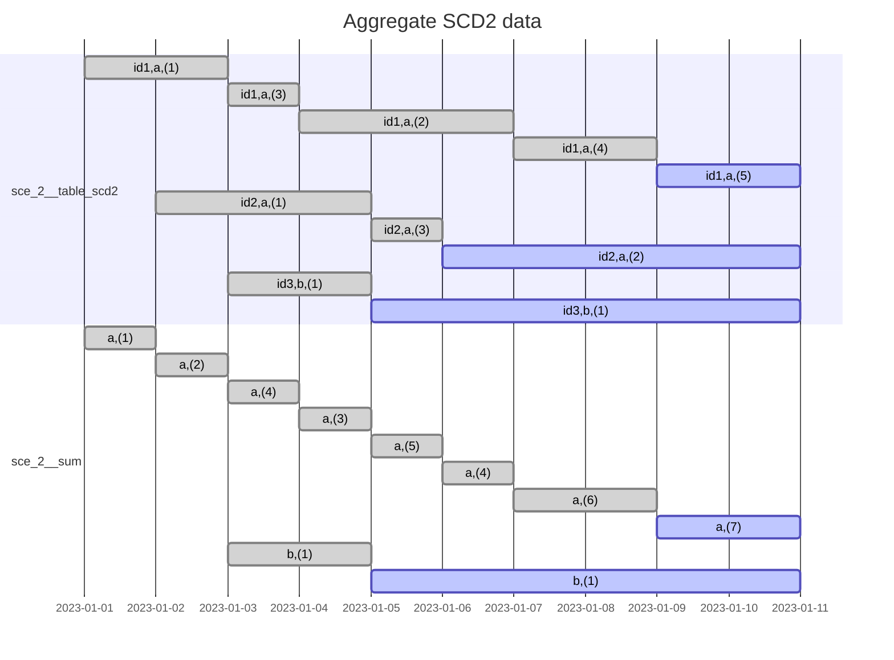

# Scenario 2: Aggregate SCD2

## Problem

Suppose you have an SCD2 table that has the value of each ID over time.
Each ID has its associated group.

Write a query that returns the summed value for each group, over time.

If the table was SCD1, then it would simply look like:

```sql
select group_id, sum(val) from sce_2__table group by all;
```

### Observation

We need to re-slice each record with regard to the grouping column, and then do the aggregation.

## Setup

```sh
dbt build --select +sce_2__aggregate_scd2
```



## Generating mermaid Gantt chart sections

```sql
select
    concat_ws(',', group_id, '(' || summed_val || ')')
        || ' : '
        || concat_ws(', ',
                     if(valid_to < '2023-01-11', 'done', 'active'),
                     valid_from::date,
                     if(valid_to < '2023-01-11', valid_to::date, '2023-01-11')
           )
from sce_2__sum
order by group_id, valid_from;
```
