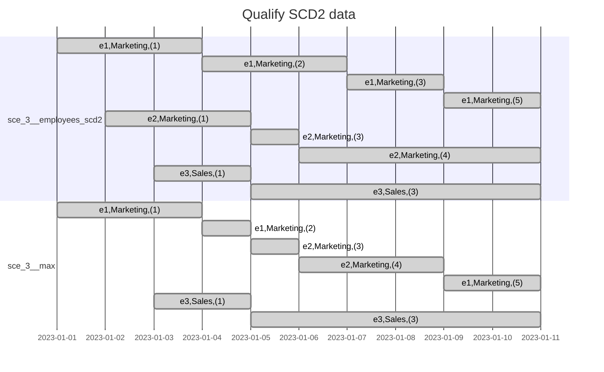

# Scenario 3: Qualify SCD2

## Problem

Suppose you have an Employees SCD2 table that has the following columns:
employee_id, department, num_feedback_provided, valid_from, valid_to.

Write a query that tracks the change of the individual who provided the most feedback.

If the table was SCD1, then it would look like:

```sql
select employee_id, department, num_feedback_provided
from sce_3__employees_scd2
qualify row_number() over (partition by employee_id order by num_feedback_provided desc) = 1;
```

### Observation

Same as the aggregation of SCD2 data, we need to re-slice each record with regard to the partitioning column,
then do the qualify calculation.

Also after selecting rows with `qualify`, we need to re-calculate validity ranges to merge records that
happen to have the same values after the `qualify`.

## Setup

```sh
dbt build --select +sce_3__qualify_scd2
```



## Generating mermaid Gantt chart sections

```sql
select
    concat_ws(',', 'e' || employee_id, department, '(' || num_feedback_provided || ')')
        || ' : '
        || concat_ws(', ',
                     'done',
                     valid_from::date,
                     if(valid_to < '2023-01-11', valid_to::date, '2023-01-11')
           )
from dev.main_sce_3__qualify_scd2.sce_3__employees_scd2
order by department, employee_id, valid_from;
```
