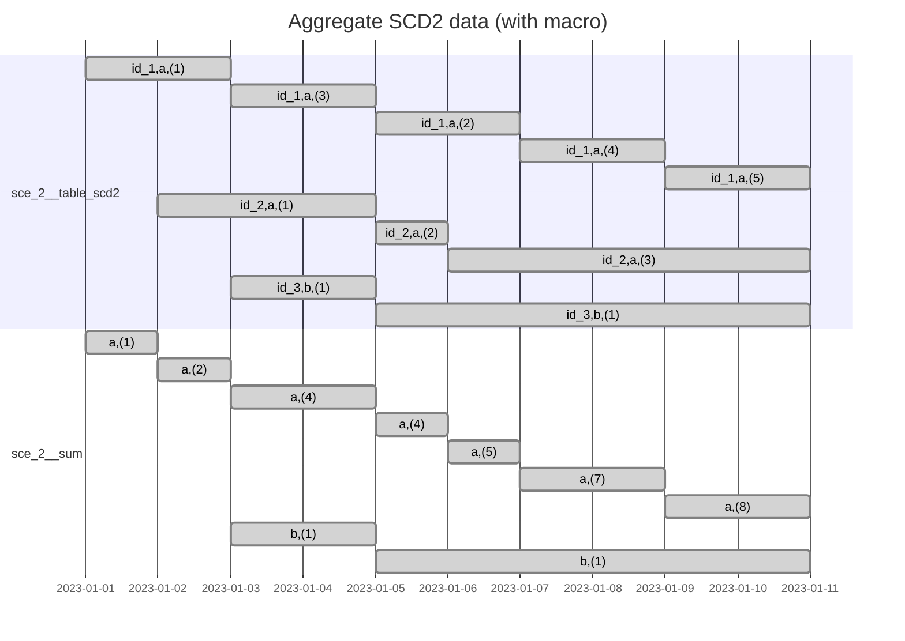

# Scenario 4: Aggregate SCD2 with macros

## Problem

Do the same problem as in [Scenario 2](./sce_2__aggregate_scd2.md), but use macros to simplify the solution.

## Setup

```sh
dbt build --select +sce_4__aggregate_scd2_with_macros
```



## Generating mermaid Gantt chart sections

```sql
select
    concat_ws(',', group_id, '(' || summed_val || ')')
        || ' : '
        || concat_ws(', ',
                     if(valid_to < '2023-01-11', 'done', 'active'),
                     valid_from::date,
                     if(valid_to < '2023-01-11', valid_to::date, '2023-01-11')
           )
from sce_2__sum
order by group_id, valid_from;
```
