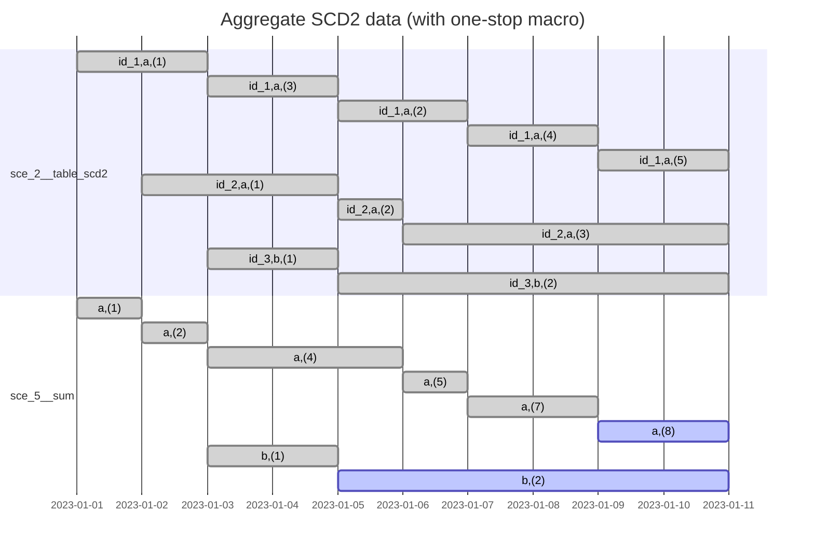
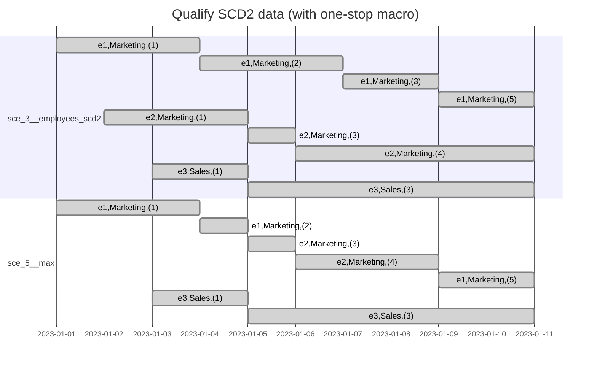

# Scenario 5: Aggregate SCD2 with one macro

## Problem

Do the same problem as in [Scenario 2](./sce_2__aggregate_scd2.md) and [Scenario 3](./sce_3__qualify_scd2.md)
but use just one macro to simplify the solution except the aggregation part.

## Setup

```sh
dbt build --select +path:models/sce_5__aggregate_scd2_with_one_stop_macro
```





## Generating mermaid Gantt chart sections

```sql
select
    concat_ws(',', group_id, '(' || summed_val || ')')
        || ' : '
        || concat_ws(', ',
                     if(valid_to < '2023-01-11', 'done', 'active'),
                     valid_from::date,
                     if(valid_to < '2023-01-11', valid_to::date, '2023-01-11')
           )
from sce_5__sum
order by group_id, valid_from;
```

```sql
select
    concat_ws(',', 'e' || employee_id, department, '(' || num_feedback_provided || ')')
        || ' : '
        || concat_ws(', ',
                     'done',
                     valid_from::date,
                     if(valid_to < '2023-01-11', valid_to::date, '2023-01-11')
           )
from sce_5__max
order by department, valid_from, employee_id;
```
