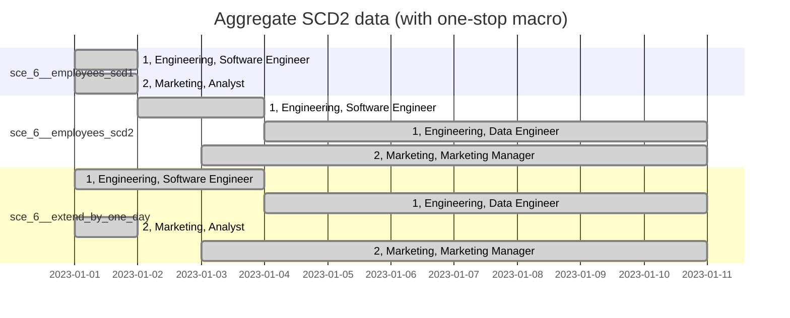

# Scenario 6: Extend an SCD2 to the past

## Problem

You have an SCD2 table that holds the history from 2 Jan. Its granularity of recognising
a change is daily.

Now you are given the table state on 1 Jan, and want to include it in the SCD2 table
to make the SCD2 to have history from 1 Jan.

## Setup

```sh
dbt build --select +path:models/sce_6__extend_scd2_to_past
```



## Generating mermaid Gantt chart sections

```sh
dbt run-operation op_render_mermaid_gantt \
    --args "{relation: sce_6__extend_by_one_day, columns: [employee_id, department, role], order_by: [employee_id, valid_from]}"
```
